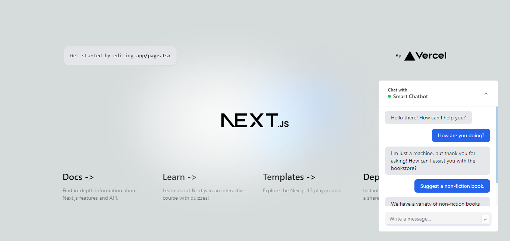

# Smart Chatbot

An incredibly smart chatbot to provide customer assistance, engage the visitors, and make the overall experience really intuitive.

## Screenshot



<p align="center">
  <a href="https://bot.nabarun.app"><strong>View Project »</strong></a>
</p>

## Running Locally

This application requires Node.js v16.13+.

### Cloning the repository to the local machine:

```bash
git clone https://github.com/nabarvn/smart-chatbot.git
cd smart-chatbot
```

### Installing the dependencies:

```bash
npm install
```

### Setting up the `.env` file:

```bash
cp .env.example .env
```

> [!IMPORTANT]
> Ensure you populate the variables with your respective API keys and configuration values before proceeding.

### Running the application:

```bash
npm run dev
```

## Tech Stack

- **Language**: [TypeScript](https://www.typescriptlang.org)
- **Framework**: [Next.js](https://nextjs.org)
- **Styling**: [Tailwind CSS](https://tailwindcss.com)
- **Analytics**: [Vercel Analytics](https://vercel.com/analytics)
- **State Management**: [React Query](https://www.npmjs.com/package/@tanstack/react-query)
- **API**: [OpenAI](https://platform.openai.com/docs/introduction)
- **Rate Limiter**: [Upstash](https://docs.upstash.com/redis)
- **Deployment**: [Vercel](https://vercel.com)

## Credits

Learned a ton while building this project. All thanks to Josh for the next level (no pun intended) tutorial!

<hr />

<div align="center">Don't forget to leave a STAR 🌟</div>
